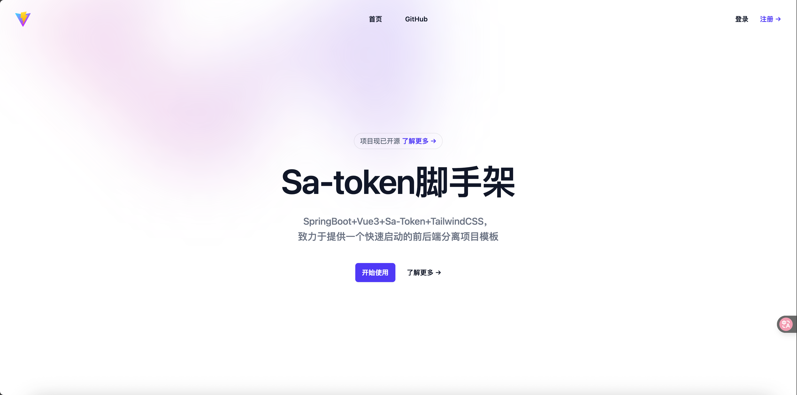

# SaToken-Vue3快速启动项目模板

[](https://opensource.org/licenses/MIT)
[](https://vuejs.org/)
[](https://spring.io/projects/spring-boot)
[](https://sa-token.dev33.cn/)
[](https://baomidou.com/)
[](https://tailwindcss.com/)
[](https://www.mysql.com/)
[](https://github.com/Guducat/SaToken-FastStart)

## 项目简介

本项目是一个基于 Spring Boot 3 和 Vue 3 技术栈的全栈快速启动模板。后端采用 Java，集成 Sa-Token 进行认证授权，MyBatis-Plus 操作数据库（支持 MySQL/PostgreSQL）。前端使用 Vite 构建，采用 TailwindCSS 和 Headless UI 设计现代化用户界面。
该模板旨在提供一个包含用户管理、权限控制、登录注册、密码找回等核心功能的轻量级前后端分离解决方案。

前端界面主要用于功能演示，实际项目中需要根据需求进行替换和扩展。

### 功能特点

- ✅ **用户管理模块 (后端 & 前端)**
  - 简易用户注册功能 (支持用户名、邮箱)
  - 简易用户登录功能 (支持用户名、邮箱)
  - 获取用户信息
  - 更新用户信息 (昵称、邮箱、头像)
  - 简易密码找回功能 (通过用户名和邮箱验证身份，重置密码)
  - 注销账户
  - 查询登录状态
- ✅ **管理员模块 (后端 & 前端)**
  - 查看所有用户列表
  - 查看单个用户信息
  - 删除用户
- ✅ **权限控制 (Sa-Token)**
  - 基于角色的访问控制 (管理员、普通用户)
  - 接口权限校验
- ✅ **前端特性**
  - 基于 Vue 3 和 Vite 构建
  - 使用 TailwindCSS 和 Headless UI 实现现代化界面
  - 响应式设计，适配不同设备
  - 包含登录、注册、用户中心、管理员控制台等核心页面
  - 模块化组件 (页头、页脚等)
- ✅ **后端特性**
  - 基于 Spring Boot 3 构建
  - 使用 MyBatis-Plus 简化数据库操作
  - RESTful API 设计
  - Sa-Token 集成，提供安全认证机制
## 项目预览




## 快速开始

### 环境要求

- **后端:**
  - JDK 17+ (项目配置为 Java 17)
  - Maven 3.6+ (用于构建后端项目)
  - Spring Boot 3.4.5
- **前端:**
  - Node.js 18+ 
  - pnpm/npm/yarn 
  - Vue 3.5.13
  - Vite 6.3.1
  - TailwindCSS 4.1.4
- **数据库:**
  - MySQL 8.0+ 或 PostgreSQL 12+ (或其他兼容的数据库，按需调整 `pom.xml` 和 `application.properties` 中的依赖和配置)

### 数据库配置

1. 创建数据库和表

```sql
-- 创建数据库
CREATE DATABASE IF NOT EXISTS satoken_vue3 DEFAULT CHARACTER SET utf8mb4 COLLATE utf8mb4_unicode_ci;

USE satoken_vue3;

-- 创建用户表
CREATE TABLE IF NOT EXISTS `user` (
  `id` bigint NOT NULL AUTO_INCREMENT,
  `username` varchar(50) NOT NULL COMMENT '用户名',
  `password` varchar(100) NOT NULL COMMENT '密码',
  `nickname` varchar(50) DEFAULT NULL COMMENT '昵称',
  `avatar_url` varchar(255) DEFAULT NULL COMMENT '头像URL',
  `email` varchar(100) DEFAULT NULL COMMENT '邮箱',
  `role` varchar(20) DEFAULT 'user' COMMENT '权限',
  `create_time` datetime DEFAULT CURRENT_TIMESTAMP COMMENT '创建时间',
  `update_time` datetime DEFAULT CURRENT_TIMESTAMP ON UPDATE CURRENT_TIMESTAMP COMMENT '更新时间',
  PRIMARY KEY (`id`),
  UNIQUE KEY `uk_username` (`username`),
  UNIQUE KEY `uk_email` (`email`)
) ENGINE=InnoDB DEFAULT CHARSET=utf8mb4 COMMENT='用户表';

-- 创建管理员账号
-- 密码为 admin，使用 SHA-256 加密
INSERT INTO `user` (`username`, `password`, `nickname`, `role`, `email`) VALUES
('admin', '8c6976e5b5410415bde908bd4dee15dfb167a9c873fc4bb8a81f6f2ab448a918', '管理员', 'admin', 'admin@example.com');
```

2. 修改后端数据库配置

编辑 `backend/src/main/resources/application.properties` 文件，配置数据库连接信息：

```properties
# 数据库配置
spring.datasource.driver-class-name=com.mysql.cj.jdbc.Driver
spring.datasource.url=jdbc:mysql://localhost:3306/数据库名?useUnicode=true&characterEncoding=utf-8&serverTimezone=Asia/Shanghai
spring.datasource.username=root
spring.datasource.password=your_password
```

### 运行项目

1. 启动后端

```bash
cd backend
mvn spring-boot:run
```

2. 启动前端

```bash
cd fronted
npm install
npm run dev
```

3. 访问前端应用

打开浏览器访问：`http://localhost:5173`

### 默认账号

- 管理员账号：`admin`
- 密码：`admin`

## 项目结构

```
SaToken-Vue3/
├── backend/              # 后端项目
│   ├── src/main/java/    # Java 源代码
│   │   ├── config/       # 配置类
│   │   ├── controller/   # 控制器
│   │   ├── entity/       # 实体类
│   │   ├── mapper/       # MyBatis 映射器
│   │   └── service/      # 服务层
│   └── src/main/resources/ # 资源文件
│       └── application.properties # 应用配置
├── fronted/               # 前端项目
│   ├── public/           # 静态资源
│   ├── src/              # 源代码
│   │   ├── api/          # API 调用
│   │   ├── components/    # 组件
│   │   ├── router/        # 路由
│   │   └── views/         # 页面
│   ├── index.html        # HTML 模板
│   ├── package.json      # 依赖配置
│   └── vite.config.js     # Vite 配置
└── readme.md              # 项目说明
```

## 其他

**声明** 本项目使用了大语言模型辅助编码，在 *Claude3.7Sonnet* 以及 *Gemini 2.5Pro 05-06* 的帮助下一些隐形BUG得以解决。

欢迎提交 [Issue](https://github.com/Guducat/SaToken-FastStart/issues) 或 [Pull Request](https://github.com/Guducat/SaToken-FastStart/pulls),让我们一起改进此模板！

## 许可证

[](https://opensource.org/licenses/MIT)